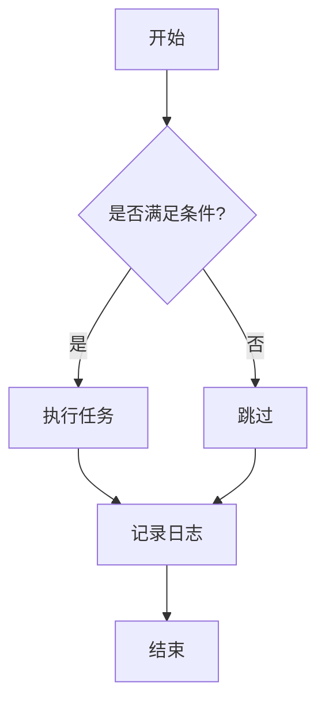
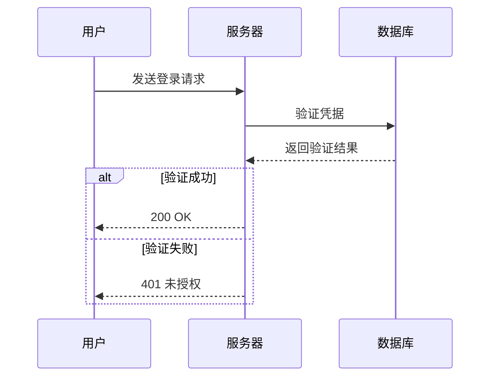
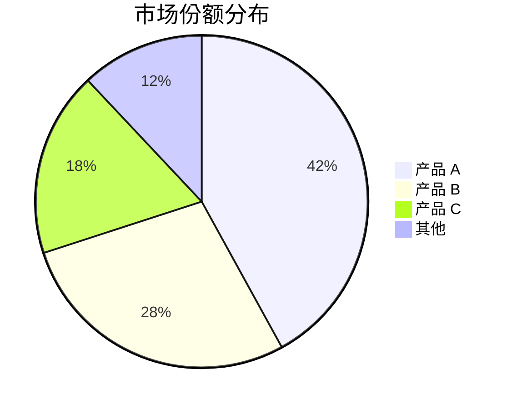
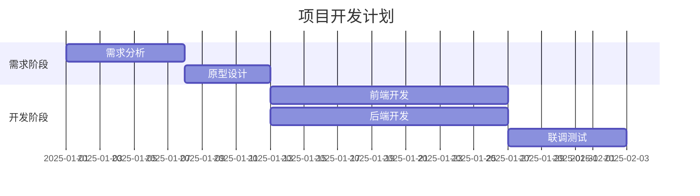
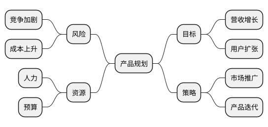
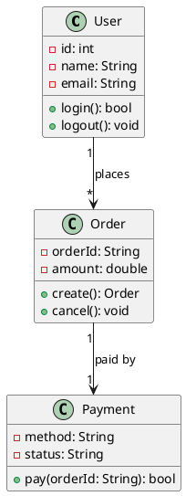
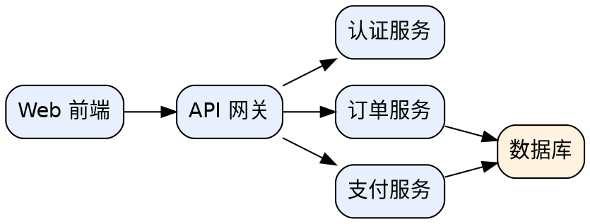

# 测试文档（Test Document）

> 本文件用于测试 Markdown 渲染器的各项语法支持情况。
> 创建时间：2025-08-31

## 1. 标题（Heading）

# H1 一级标题
## H2 二级标题
### H3 三级标题
#### H4 四级标题
##### H5 五级标题
###### H6 六级标题

## 2. 文本样式（Text Style）

**粗体文字** 和 *斜体文字* 以及 ***粗斜体***。

~~删除线~~ 、`行内代码` 、<u>下划线</u> 和 ==高亮==。

普通文本，包含中文、English、数字 123、特殊字符 `!@#$%^&*()`。

## 3. 列表（List）

### 无序列表

- 苹果
- 香蕉
- 橙子
  - 嵌套项一
  - 嵌套项二
    - 更深嵌套

### 有序列表

1. 第一步
2. 第二步
3. 第三步
   1. 子步骤 A
   2. 子步骤 B

### 任务列表

- [x] 已完成任务
- [ ] 未完成任务
- [ ] 待办事项

## 4. 引用（Blockquote）

> 这是一段引用。
>
> > 这是嵌套引用。
>
> 引用中可以包含 **粗体** 和 `代码`。

## 5. 代码块（Code Block）

```python
def hello(name: str) -> str:
    """Say hello."""
    return f"Hello, {name}!"

print(hello("World"))
```

```javascript
// JavaScript 示例
const greet = (name) => `Hello, ${name}!`;
console.log(greet("World"));
```

```bash
# Shell 示例
echo "Hello from bash"
ls -la /tmp
```

## 6. 表格（Table）

| 姓名 | 年龄 | 城市 | 备注 |
| :--- | :--: | ---: | ---- |
| 张三 | 25 | 北京 | 左对齐 |
| 李四 | 30 | 上海 | 居中 |
| 王五 | 28 | 深圳 | 右对齐 |
| 赵六 | 35 | 广州 | 普通 |

## 7. 链接（Link）

- [Markdown 官方文档](https://daringfireball.net/projects/markdown/)
- [相对链接](./test.md)
- [锚点跳转](#6-表格table)
- 自动链接：<https://www.example.com>
- 带标题的链接：[悬停查看标题](https://example.com "这是一个标题")

## 8. 图片（Image）


## 9. 分割线（Horizontal Rule）

---

***

___

## 10. 数学公式（Math）

行内公式：$E = mc^2$

块级公式：

$$
\int_0^\infty e^{-x^2} dx = \frac{\sqrt{\pi}}{2}
$$

## 11. 脚注（Footnote）

这是一个带脚注的句子[^1]，这是另一个脚注[^note]。

[^1]: 第一个脚注的内容。
[^note]: 命名脚注，内容如下：
    多行脚注内容也支持。

## 12. HTML 元素（HTML Elements）

<div align="center">
  <b>居中的 HTML 内容</b>
</div>

<br/>

<details>
  <summary>点击展开</summary>

  这里是折叠的详细内容。

</details>

## 13. Emoji 与表情

:smile: :rocket: :+1: :fire: :warning:

## 14. 定义列表（Definition List）

Markdown
: 一种轻量级标记语言，由 John Gruber 于 2004 年创建。

GFM
: GitHub Flavored Markdown，是 GitHub 对 Markdown 的扩展。

## 15. 转义字符（Escaping）

\*不是斜体\*，\_不是斜体\_，\# 不是标题。

## 16. 其他测试内容

> **注意**：以下内容用于测试长文本换行与滚动。

Lorem ipsum dolor sit amet, consectetur adipiscing elit. Sed do eiusmod tempor incididunt ut labore et dolore magna aliqua. Ut enim ad minim veniam, quis nostrud exercitation ullamco laboris nisi ut aliquip ex ea commodo consequat. Duis aute irure dolor in reprehenderit in voluptate velit esse cillum dolore eu fugiat nulla pariatur. Excepteur sint occaecat cupidatat non proident, sunt in culpa qui officia deserunt mollit anim id est laborum. 这是一段用于测试渲染器换行处理的中文长文本，包含标点符号，句号。逗号，以及一些特殊字符和数字1234567890。主要用于验证中文与英文混排时的排版效果是否正常，以及长段落是否能够正确换行展示。

## 17. 演示图表（Demo Charts）

### 17.1 Mermaid 流程图（Flowchart）



### 17.2 Mermaid 时序图（Sequence Diagram）



### 17.3 Mermaid 饼图（Pie Chart）



### 17.4 Mermaid 甘特图（Gantt Chart）



### 17.5 PlantUML 思维导图（Mind Map）



### 17.6 PlantUML 类图（Class Diagram）



### 17.7 Vega-Lite 柱状图（Bar Chart）

```vega-lite
{
  "$schema": "https://vega.github.io/schema/vega-lite/v5.json",
  "data": {
    "values": [
      {"month": "1月", "sales": 120},
      {"month": "2月", "sales": 165},
      {"month": "3月", "sales": 142},
      {"month": "4月", "sales": 198},
      {"month": "5月", "sales": 175},
      {"month": "6月", "sales": 220}
    ]
  },
  "mark": "bar",
  "encoding": {
    "x": {"field": "month", "type": "nominal", "sort": null},
    "y": {"field": "sales", "type": "quantitative"},
    "color": {"value": "#4e79a7"}
  },
  "title": "月度销售额"
}
```

### 17.8 Vega-Lite 折线图（Line Chart）

```vega-lite
{
  "$schema": "https://vega.github.io/schema/vega-lite/v5.json",
  "data": {
    "values": [
      {"week": 1, "series": "实际", "value": 30},
      {"week": 2, "series": "实际", "value": 45},
      {"week": 3, "series": "实际", "value": 40},
      {"week": 4, "series": "实际", "value": 62},
      {"week": 1, "series": "预测", "value": 32},
      {"week": 2, "series": "预测", "value": 42},
      {"week": 3, "series": "预测", "value": 50},
      {"week": 4, "series": "预测", "value": 58}
    ]
  },
  "mark": {"type": "line", "point": true},
  "encoding": {
    "x": {"field": "week", "type": "ordinal"},
    "y": {"field": "value", "type": "quantitative"},
    "color": {"field": "series", "type": "nominal"}
  },
  "title": "周趋势对比"
}
```

### 17.9 Vega-Lite 环形图（Donut Chart）

```vega-lite
{
  "$schema": "https://vega.github.io/schema/vega-lite/v5.json",
  "data": {
    "values": [
      {"category": "企业版", "value": 42},
      {"category": "云服务", "value": 28},
      {"category": "硬件", "value": 18},
      {"category": "服务", "value": 12}
    ]
  },
  "mark": {"type": "arc", "innerRadius": 55},
  "encoding": {
    "theta": {"field": "value", "type": "quantitative"},
    "color": {"field": "category", "type": "nominal"}
  },
  "title": "营收构成"
}
```

### 17.10 Infographic KPI 卡片（Metric Cards）

```infographic
infographic list-grid-badge-card
data
  title 核心指标
  desc 年度经营概览
  items
    - label 总收入
      desc 12.8 亿 | 同比 +23.5%
    - label 新增客户
      desc 3280 | 同比 +45%
    - label 客户满意度
      desc 94.6% | 行业领先
    - label 市场份额
      desc 18.5% | 排名 #2
```

### 17.11 Infographic 时间线（Timeline）

```infographic
infographic sequence-timeline-simple
data
  title 产品路线图
  items
    - label 调研
      time 2025 Q1
      desc 市场与用户调研
    - label 设计
      time 2025 Q2
      desc 交互与视觉设计
    - label 开发
      time 2025 Q3
      desc 前后端开发联调
    - label 发布
      time 2025 Q4
      desc 正式上线运营
```

### 17.12 Infographic 漏斗图（Funnel）

```infographic
infographic sequence-filter-mesh-simple
data
  title 销售漏斗
  items
    - label 线索
      value 10000
      desc 市场线索
    - label 合格
      value 2500
      desc 转化率 25%
    - label 方案
      value 800
      desc 转化率 32%
    - label 成交
      value 328
      desc 转化率 41%
```

### 17.13 Canvas 概念图（Concept Map）

```canvas
{
  "nodes": [
    {"id": "n1", "type": "text", "text": "Markdown", "x": 300, "y": 0, "width": 140, "height": 50, "color": "1"},
    {"id": "n2", "type": "text", "text": "语法", "x": 0, "y": 150, "width": 120, "height": 50, "color": "4"},
    {"id": "n3", "type": "text", "text": "图表", "x": 200, "y": 150, "width": 120, "height": 50, "color": "5"},
    {"id": "n4", "type": "text", "text": "样式", "x": 400, "y": 150, "width": 120, "height": 50, "color": "6"},
    {"id": "n5", "type": "text", "text": "代码块", "x": 100, "y": 300, "width": 120, "height": 50, "color": "2"},
    {"id": "n6", "type": "text", "text": "流程图", "x": 300, "y": 300, "width": 120, "height": 50, "color": "3"}
  ],
  "edges": [
    {"id": "e1", "fromNode": "n1", "fromSide": "bottom", "toNode": "n2", "toSide": "top", "toEnd": "arrow"},
    {"id": "e2", "fromNode": "n1", "fromSide": "bottom", "toNode": "n3", "toSide": "top", "toEnd": "arrow"},
    {"id": "e3", "fromNode": "n1", "fromSide": "bottom", "toNode": "n4", "toSide": "top", "toEnd": "arrow"},
    {"id": "e4", "fromNode": "n2", "fromSide": "bottom", "toNode": "n5", "toSide": "top", "toEnd": "arrow"},
    {"id": "e5", "fromNode": "n3", "fromSide": "bottom", "toNode": "n6", "toSide": "top", "toEnd": "arrow"}
  ]
}
```

### 17.14 Graphviz 依赖图（Dependency Graph）



---

*测试结束，感谢使用！*
