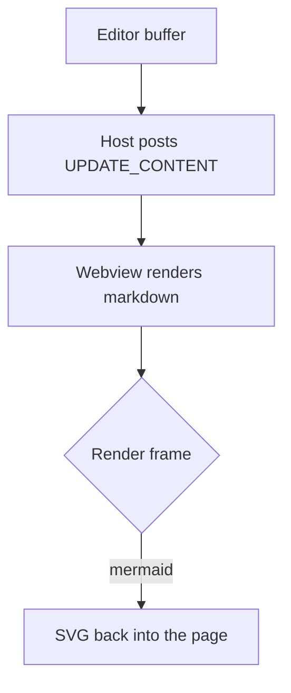

# Diagram Fixture

A fenced diagram is the mainstream way to put a diagram in a document, and it
is the path that goes through the webview's sandboxed render frame.

```mermaid
graph TD
  A[Editor buffer] --> B[Host posts UPDATE_CONTENT]
  B --> C[Webview renders markdown]
  C --> D{Render frame}
  D -->|mermaid| E[SVG back into the page]
```
