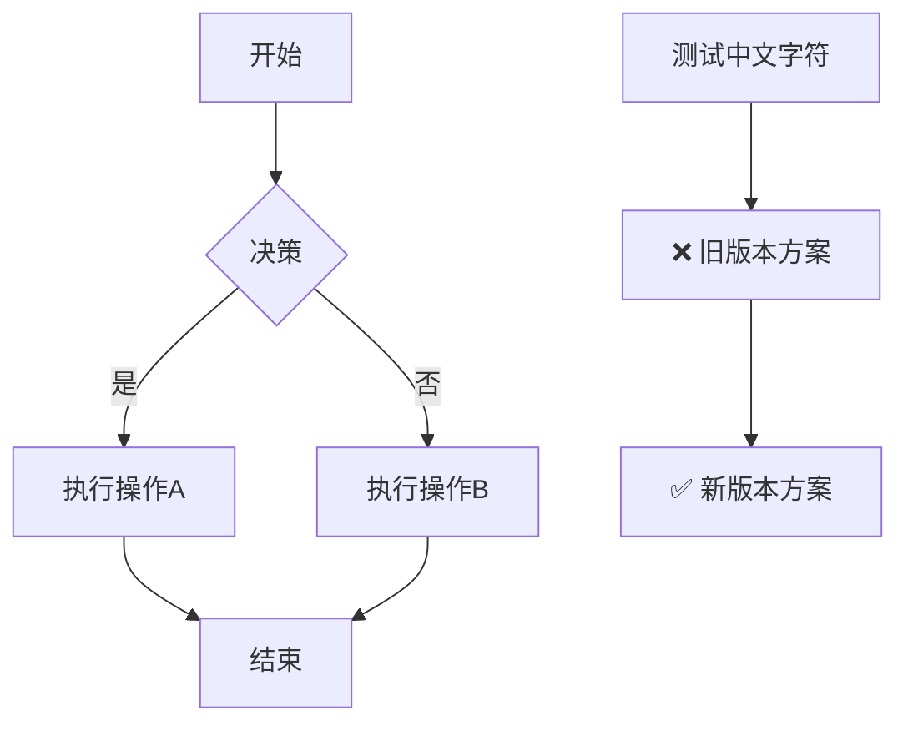
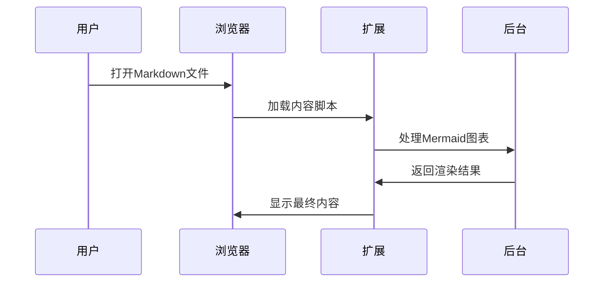
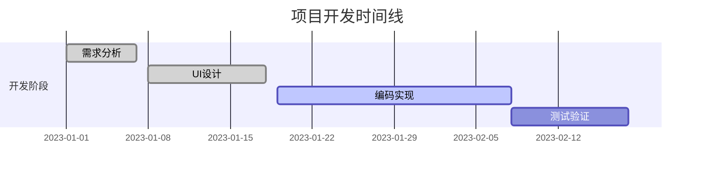

# Markdown Viewer Extension 功能测试

这个文档用于测试扩展的各种功能和边界情况。

## 目录概览

本测试文档按照功能复杂度和重要性进行组织：

1. **基础语法** - Markdown核心语法测试
2. **文本格式** - 格式化和特殊字符
3. **列表和表格** - 结构化内容
4. **代码语法高亮** - 多语言代码支持
5. **数学公式** - KaTeX数学渲染
6. **图表和图像** - Mermaid图表和SVG处理
7. **HTML混合内容** - 复杂布局测试
8. **错误处理** - 边界情况和异常
9. **测试总结** - 功能覆盖清单

---

## 1. 基础 Markdown 语法测试

### 1.1 标题层级测试
# 一级标题
## 二级标题
### 三级标题
#### 四级标题
##### 五级标题
###### 六级标题

### 1.2 文本格式化
**粗体文本**  
*斜体文本*  
~~删除线~~  
`行内代码`  
普通文本和 **混合** *格式* ~~测试~~

### 1.3 链接测试
[GitHub链接](https://github.com)  
[相对链接](./README.md)  
[锚点链接](#测试总结)

### 1.4 图片基础测试


*注意：SVG图片的详细测试请参见第6节图表和图像测试*

---

## 2. 文本格式和特殊字符

### 2.1 引用和分割线
> 这是一个简单的引用
> 
> 支持多行引用
> 
> > 嵌套引用测试
> > 
> > 包含**格式化**文本

分割线样式测试：

---

***

___

### 2.2 特殊字符测试
特殊符号测试：@ # $ % ^ & * ( ) [ ] { } | \ ` ~ ! ? < > " '

中文标点：，。！？；：""''（）【】《》

Emoji测试：😀 🎉 🚀 ✅ ❌ 🔥 💡 📝

### 2.3 转义字符测试
\*不是斜体\*  
\`不是代码\`  
\# 不是标题  
\[不是链接\](test)

---

## 3. 列表和表格

### 3.1 标准列表
**无序列表：**
- 标准项目 1
- 标准项目 2
  - 嵌套项目 2.1
  - 嵌套项目 2.2
- 标准项目 3

**有序列表：**
1. 第一项
2. 第二项
   1. 嵌套有序列表 1
   2. 嵌套有序列表 2
3. 第三项

### 3.2 非标准列表（测试列表规范化）
• 使用圆点符号的项目 1
• 使用圆点符号的项目 2
	• 使用tab缩进的嵌套项目
	• 另一个tab缩进项目

● 使用实心圆点的项目 1
● 使用实心圆点的项目 2

**混合列表：**
1. 有序列表项
   - 无序子项目
   - 另一个无序子项目
2. 另一个有序项
   • 使用圆点的子项目
   • 测试符号混合

### 3.3 表格测试
**基础表格：**
| 功能 | 状态 | 描述 |
|------|------|------|
| Markdown解析 | ✅ | 基础语法支持 |
| 数学公式 | ✅ | KaTeX渲染 |
| 代码高亮 | ✅ | 多语言支持 |
| Mermaid图表 | ✅ | 多种图表类型 |

**对齐表格：**
| 左对齐 | 居中 | 右对齐 |
|:-------|:----:|-------:|
| 内容1 | 内容2 | 内容3 |
| 长内容测试 | 中文测试 | 123 |

---

## 4. 代码语法高亮测试

### 4.1 JavaScript 代码
```javascript
// ES6+ JavaScript 特性测试
async function fetchUserData(userId) {
    try {
        const response = await fetch(`/api/users/${userId}`);
        const userData = await response.json();
        return { success: true, data: userData };
    } catch (error) {
        console.error('获取用户数据失败:', error);
        throw new Error(`无法获取用户 ${userId} 的数据`);
    }
}

// 箭头函数和解构赋值
const processData = ({ name, age, ...rest }) => ({
    displayName: name.toUpperCase(),
    category: age >= 18 ? 'adult' : 'minor',
    metadata: rest
});
```

### 4.2 Python 代码
```python
# Python 类型提示和装饰器
from typing import List, Dict, Optional
import asyncio

class DataProcessor:
    def __init__(self, config: Dict[str, str]):
        self.config = config
        self.results: List[str] = []
    
    async def process_items(self, items: List[str]) -> Optional[Dict]:
        """处理数据项并返回结果"""
        processed = []
        for item in items:
            if item.strip():  # 过滤空字符串
                result = await self._process_single_item(item)
                processed.append(result)
        
        return {"total": len(processed), "items": processed}
    
    async def _process_single_item(self, item: str) -> str:
        # 模拟异步处理
        await asyncio.sleep(0.1)
        return f"处理完成: {item}"
```

### 4.3 Java 代码
```java
// Java 泛型和注解
@RestController
@RequestMapping("/api/v1")
public class UserController {
    
    @Autowired
    private UserService userService;
    
    @GetMapping("/users/{id}")
    public ResponseEntity<UserDTO> getUser(@PathVariable Long id) {
        try {
            Optional<User> user = userService.findById(id);
            return user.map(u -> ResponseEntity.ok(UserDTO.fromEntity(u)))
                      .orElse(ResponseEntity.notFound().build());
        } catch (Exception e) {
            logger.error("获取用户失败: {}", e.getMessage());
            return ResponseEntity.status(HttpStatus.INTERNAL_SERVER_ERROR).build();
        }
    }
}
```

### 4.4 SQL 代码
```sql
-- 复杂查询示例
WITH user_stats AS (
    SELECT 
        u.id,
        u.username,
        COUNT(p.id) as post_count,
        AVG(p.rating) as avg_rating
    FROM users u
    LEFT JOIN posts p ON u.id = p.user_id
    WHERE u.created_at >= '2024-01-01'
    GROUP BY u.id, u.username
),
top_users AS (
    SELECT *
    FROM user_stats
    WHERE post_count > 10
    ORDER BY avg_rating DESC
    LIMIT 20
)
SELECT 
    tu.username,
    tu.post_count,
    ROUND(tu.avg_rating, 2) as rating,
    CASE 
        WHEN tu.avg_rating >= 4.5 THEN '优秀'
        WHEN tu.avg_rating >= 3.5 THEN '良好'
        ELSE '一般'
    END as level
FROM top_users tu
ORDER BY tu.avg_rating DESC;
```

### 4.5 HTML/CSS 代码
```html
<!DOCTYPE html>
<html lang="zh-CN">
<head>
    <meta charset="UTF-8">
    <meta name="viewport" content="width=device-width, initial-scale=1.0">
    <title>响应式卡片组件</title>
    <style>
        .card-container {
            display: grid;
            grid-template-columns: repeat(auto-fit, minmax(300px, 1fr));
            gap: 1.5rem;
            padding: 2rem;
        }
        
        .card {
            background: linear-gradient(135deg, #667eea 0%, #764ba2 100%);
            border-radius: 12px;
            padding: 1.5rem;
            color: white;
            transition: transform 0.3s ease;
        }
        
        .card:hover {
            transform: translateY(-5px);
        }
    </style>
</head>
<body>
    <div class="card-container">
        <div class="card">
            <h3>功能特性</h3>
            <p>支持多种编程语言的语法高亮显示</p>
        </div>
    </div>
</body>
</html>
```

### 4.6 Shell 脚本
```bash
#!/bin/bash
# 自动化部署脚本

set -e  # 遇到错误立即退出

APP_NAME="markdown-viewer"
VERSION=${1:-"latest"}
DEPLOY_DIR="/opt/apps/$APP_NAME"
LOG_FILE="/var/log/${APP_NAME}-deploy.log"

function log() {
    local message="[$(date +'%Y-%m-%d %H:%M:%S')] $1"
    echo "$message"
    echo "$message" >> "$LOG_FILE"
}

function check_requirements() {
    log "检查系统要求..."
    
    # 检查Docker环境
    if ! command -v docker &> /dev/null; then
        log "错误: Docker 未安装"
        exit 1
    fi
    
    # 检查docker-compose
    if ! command -v docker-compose &> /dev/null; then
        log "错误: docker-compose 未安装"
        exit 1
    fi
    
    log "系统要求检查通过"
}

function deploy() {
    log "开始部署 $APP_NAME:$VERSION"
    check_requirements
    
    # 创建部署目录
    sudo mkdir -p "$DEPLOY_DIR"
    cd "$DEPLOY_DIR"
    
    # 停止旧容器
    log "停止现有容器..."
    docker-compose down 2>/dev/null || true
    
    # 启动新容器
    log "启动容器..."
    if docker-compose up -d; then
        log "✅ 部署完成，服务正常运行"
    else
        log "❌ 容器启动失败"
        exit 1
    fi
}

# 主程序
case "${1:-deploy}" in
    "deploy") deploy ;;
    "help") echo "用法: $0 [deploy|help]" ;;
    *) echo "未知操作: $1"; exit 1 ;;
esac
```

### 4.7 内联代码高亮测试
在文本中使用 `console.log()` 和 `print()` 等内联代码，以及 `async/await`、`lambda`、`SELECT`、`function` 等关键字应该也会被正确高亮。

JavaScript中的 `Promise` 和 `fetch()` API，Python中的 `asyncio` 模块，以及SQL中的 `JOIN` 和 `WHERE` 子句都是现代编程的重要概念。

---

## 5. 数学公式测试 (KaTeX)

### 5.1 行内数学公式
这是行内公式：$E = mc^2$，还有 $\alpha + \beta = \gamma$

数学表达式可以与文本混合：当 $x \to \infty$ 时，函数 $f(x) = \frac{1}{x}$ 趋于 $0$。

### 5.2 块级数学公式
**二次方程求根公式：**
$$
\frac{-b \pm \sqrt{b^2 - 4ac}}{2a}
$$

**求和公式：**
$$
\sum_{i=1}^{n} x_i = x_1 + x_2 + \cdots + x_n
$$

**高斯积分：**
$$
\int_{-\infty}^{\infty} e^{-x^2} dx = \sqrt{\pi}
$$

**矩阵表示：**
$$
\begin{bmatrix}
a & b \\
c & d
\end{bmatrix}
\begin{bmatrix}
x \\
y
\end{bmatrix}
=
\begin{bmatrix}
ax + by \\
cx + dy
\end{bmatrix}
$$

---

## 6. 图表和图像测试

### 6.1 Mermaid 流程图


### 6.2 Mermaid 序列图


### 6.3 Mermaid 甘特图


### 6.4 Markdown Viewer Extension 整体架构图

<div style="width: 100%; max-width: 1600px; font-family: 'SimSun', 'Times New Roman', Times, serif; background: #fff; box-sizing: border-box; position: relative;">
  <style scoped>
    .ext-arch-container { display: flex; gap: 15px; }
    .ext-wing-left { width: 200px; flex-shrink: 0; }
    .ext-wing-right { width: 200px; flex-shrink: 0; }
    .ext-arch-main { flex: 1; min-width: 0; }
    .ext-arch-title { text-align: center; font-size: 24px; font-weight: bold; color: #1e3a8a; margin-bottom: 20px; }
    .ext-arch-layer { margin: 10px 0; padding: 15px; border-radius: 10px; position: relative; }
    .ext-arch-divider { display: flex; align-items: center; justify-content: center; margin: 8px 0; color: #64748b; font-size: 13px; font-style: italic; }
    .ext-arch-divider-line { flex: 1; height: 1px; background: #cbd5e1; }
    .ext-arch-divider-text { margin: 0 15px; }
    .ext-layer-user { background: linear-gradient(135deg, #fef3c7 0%, #fde68a 100%); border: 2px solid #f59e0b; }
    .ext-layer-extension { background: linear-gradient(135deg, #eff6ff 0%, #dbeafe 100%); border: 2px solid #2563eb; }
    .ext-layer-processing { background: linear-gradient(135deg, #e0f2fe 0%, #bae6fd 100%); border: 2px solid #0284c7; }
    .ext-layer-storage { background: linear-gradient(135deg, #f0fdf4 0%, #dcfce7 100%); border: 2px solid #10b981; }
    .ext-section-header { font-size: 16px; font-weight: bold; color: #334155; margin-bottom: 15px; text-align: center; }
    .ext-user-grid { display: grid; grid-template-columns: repeat(3, 1fr); gap: 15px; }
    .ext-extension-grid { display: grid; grid-template-columns: repeat(5, 1fr); gap: 12px; }
    .ext-processing-grid { display: grid; grid-template-columns: repeat(4, 1fr); gap: 12px; }
    .ext-storage-grid { display: grid; grid-template-columns: repeat(2, 1fr); gap: 15px; }
    .ext-component-box { border-radius: 8px; padding: 12px; text-align: center; box-shadow: 0 2px 4px rgba(0,0,0,0.1); }
    .ext-user-box { background: #fbbf24; border: 1.5px solid #d97706; }
    .ext-extension-box { background: #60a5fa; border: 1.5px solid #2563eb; }
    .ext-processing-box { background: #38bdf8; border: 1.5px solid #0284c7; }
    .ext-storage-box { background: #4ade80; border: 1.5px solid #16a34a; }
    .ext-component-title { font-size: 13px; font-weight: bold; color: #1e3a8a; margin-bottom: 8px; }
    .ext-component-text { font-size: 12px; color: #1e40af; line-height: 1.5; }
    .ext-component-feature { background: rgba(255,255,255,0.7); border-radius: 4px; padding: 4px; margin: 3px 0; font-size: 11px; }
    .ext-wing-panel { background: linear-gradient(135deg, #f3e8ff 0%, #e9d5ff 100%); border: 2px solid #7c3aed; border-radius: 8px; padding: 12px 12px 15px 12px; }
    .ext-wing-panel.external { background: linear-gradient(135deg, #fdf4ff 0%, #fae8ff 100%); border-color: #a855f7; }
    .ext-wing-header { font-size: 16px; font-weight: bold; text-align: center; margin-bottom: 15px; color: #581c87; }
    .ext-wing-header.external { color: #7e22ce; }
    .ext-wing-section { background: #8b5cf6; border: 1.5px solid #7c3aed; border-radius: 6px; padding: 10px; margin: 10px 0; }
    .ext-wing-section.external { background: #a855f7; border-color: #9333ea; }
    .ext-wing-section-title { font-size: 13px; font-weight: bold; color: #f3f4f6; margin-bottom: 8px; text-align: center; }
    .ext-wing-text { font-size: 11px; color: #f3f4f6; line-height: 1.4; text-align: center; }
    .ext-wing-item { background: rgba(255,255,255,0.2); border-radius: 4px; padding: 4px 6px; margin: 3px 0; font-size: 11px; }
  </style>
  <div class="ext-arch-title">Markdown Viewer Extension 整体架构</div>
  <div class="ext-arch-divider"><div class="ext-arch-divider-line"></div></div>
  <div class="ext-arch-container">
    <!-- Left Wing: Core Technologies -->
    <div class="ext-wing-left">
      <div class="ext-wing-panel">
        <div class="ext-wing-header">核心技术栈</div>
        <div class="ext-wing-section">
          <div class="ext-wing-section-title">Markdown处理</div>
          <div class="ext-wing-text">
            <div class="ext-wing-item">unified核心引擎</div>
            <div class="ext-wing-item">remark-parse解析器</div>
            <div class="ext-wing-item">remark-gfm扩展</div>
            <div class="ext-wing-item">remark-math公式</div>
            <div class="ext-wing-item">remark-rehype转换</div>
            <div class="ext-wing-item">unist-util-visit遍历</div>
          </div>
        </div>
        <div class="ext-wing-section">
          <div class="ext-wing-section-title">内容渲染</div>
          <div class="ext-wing-text">
            <div class="ext-wing-item">rehype-highlight语法高亮</div>
            <div class="ext-wing-item">rehype-katex数学渲染</div>
            <div class="ext-wing-item">rehype-stringify输出</div>
            <div class="ext-wing-item">rehype-slug锚点</div>
          </div>
        </div>
        <div class="ext-wing-section">
          <div class="ext-wing-section-title">安全机制</div>
          <div class="ext-wing-text">
            <div class="ext-wing-item">Manifest V3规范</div>
            <div class="ext-wing-item">动态脚本注入</div>
            <div class="ext-wing-item">chrome.scripting API</div>
            <div class="ext-wing-item">权限最小化</div>
          </div>
        </div>
      </div>
    </div>
    <!-- Main Architecture -->
    <div class="ext-arch-main">
      <!-- User Layer -->
      <div class="ext-arch-layer ext-layer-user">
        <div class="ext-section-header">用户交互层</div>
        <div class="ext-user-grid">
          <div class="ext-component-box ext-user-box">
            <div class="ext-component-title">用户</div>
            <div class="ext-component-text">
              <div class="ext-component-feature">文档查看</div>
              <div class="ext-component-feature">快捷键操作</div>
              <div class="ext-component-feature">目录导航</div>
            </div>
          </div>
          <div class="ext-component-box ext-user-box">
            <div class="ext-component-title">Chrome浏览器</div>
            <div class="ext-component-text">
              <div class="ext-component-feature">文件加载</div>
              <div class="ext-component-feature">扩展宿主</div>
              <div class="ext-component-feature">渲染引擎</div>
            </div>
          </div>
          <div class="ext-component-box ext-user-box">
            <div class="ext-component-title">文件系统</div>
            <div class="ext-component-text">
              <div class="ext-component-feature">本地.md文件</div>
              <div class="ext-component-feature">网络资源</div>
              <div class="ext-component-feature">相对路径</div>
            </div>
          </div>
        </div>
      </div>
        <div class="ext-arch-divider">
        <div class="ext-arch-divider-line"></div>
        <div class="ext-arch-divider-text">⬇ 自动检测激活</div>
        <div class="ext-arch-divider-line"></div>
      </div>
        <!-- Extension Layer -->
      <div class="ext-arch-layer ext-layer-extension">
        <div class="ext-section-header">Chrome扩展层</div>
        <div class="ext-extension-grid">
          <div class="ext-component-box ext-extension-box">
            <div class="ext-component-title">Content Detector</div>
            <div class="ext-component-text">
              <div class="ext-component-feature">轻量级检测脚本</div>
              <div class="ext-component-feature">文件扩展名检测</div>
              <div class="ext-component-feature">动态注入触发</div>
              <div class="ext-component-feature">.md/.markdown</div>
            </div>
          </div>
          <div class="ext-component-box ext-extension-box">
            <div class="ext-component-title">Content Script</div>
            <div class="ext-component-text">
              <div class="ext-component-feature">unified处理管道</div>
              <div class="ext-component-feature">DOM重构渲染</div>
              <div class="ext-component-feature">TOC目录生成</div>
              <div class="ext-component-feature">响应式布局</div>
            </div>
          </div>
          <div class="ext-component-box ext-extension-box">
            <div class="ext-component-title">Background Script</div>
            <div class="ext-component-text">
              <div class="ext-component-feature">消息中转代理</div>
              <div class="ext-component-feature">离屏文档管理</div>
              <div class="ext-component-feature">缓存操作代理</div>
              <div class="ext-component-feature">CSS/JS动态注入</div>
            </div>
          </div>
          <div class="ext-component-box ext-extension-box">
            <div class="ext-component-title">Popup UI</div>
            <div class="ext-component-text">
              <div class="ext-component-feature">缓存统计展示</div>
              <div class="ext-component-feature">清理操作界面</div>
              <div class="ext-component-feature">后台代理通信</div>
              <div class="ext-component-feature">状态监控</div>
            </div>
          </div>
          <div class="ext-component-box ext-extension-box">
            <div class="ext-component-title">Offscreen Document</div>
            <div class="ext-component-text">
              <div class="ext-component-feature">Mermaid图表渲染</div>
              <div class="ext-component-feature">SVG→PNG转换</div>
              <div class="ext-component-feature">html2canvas引擎</div>
              <div class="ext-component-feature">DOM_SCRAPING权限</div>
            </div>
          </div>
        </div>
      </div>
      <div class="ext-arch-divider">
        <div class="ext-arch-divider-line"></div>
        <div class="ext-arch-divider-text">⬇ 内容处理管道</div>
        <div class="ext-arch-divider-line"></div>
      </div>
      <!-- Processing Layer -->
      <div class="ext-arch-layer ext-layer-processing">
        <div class="ext-section-header">内容处理层</div>
        <div class="ext-processing-grid">
          <div class="ext-component-box ext-processing-box">
            <div class="ext-component-title">Markdown解析</div>
            <div class="ext-component-text">
              <div class="ext-component-feature">AST语法树</div>
              <div class="ext-component-feature">GFM扩展</div>
              <div class="ext-component-feature">数学公式</div>
              <div class="ext-component-feature">列表规范化</div>
            </div>
          </div>
          <div class="ext-component-box ext-processing-box">
            <div class="ext-component-title">代码语法高亮</div>
            <div class="ext-component-text">
              <div class="ext-component-feature">highlight.js</div>
              <div class="ext-component-feature">多语言支持</div>
              <div class="ext-component-feature">GitHub主题</div>
              <div class="ext-component-feature">自动识别</div>
            </div>
          </div>
          <div class="ext-component-box ext-processing-box">
            <div class="ext-component-title">图表渲染</div>
            <div class="ext-component-text">
              <div class="ext-component-feature">Mermaid→PNG</div>
              <div class="ext-component-feature">SVG→PNG</div>
              <div class="ext-component-feature">HTML→图片</div>
              <div class="ext-component-feature">离屏转换</div>
            </div>
          </div>
          <div class="ext-component-box ext-processing-box">
            <div class="ext-component-title">数学渲染</div>
            <div class="ext-component-text">
              <div class="ext-component-feature">KaTeX引擎</div>
              <div class="ext-component-feature">行内公式</div>
              <div class="ext-component-feature">块级公式</div>
              <div class="ext-component-feature">LaTeX语法</div>
            </div>
          </div>
        </div>
      </div>
      <div class="ext-arch-divider">
        <div class="ext-arch-divider-line"></div>
        <div class="ext-arch-divider-text">⬇ 缓存优化</div>
        <div class="ext-arch-divider-line"></div>
      </div>
      <!-- Storage Layer -->
      <div class="ext-arch-layer ext-layer-storage">
        <div class="ext-section-header">存储缓存层</div>
        <div class="ext-storage-grid">
          <div class="ext-component-box ext-storage-box">
            <div class="ext-component-title">Cache Manager</div>
            <div class="ext-component-text">
              <div class="ext-component-feature">双层缓存架构(L1+L2)</div>
              <div class="ext-component-feature">内存LRU缓存(100项)</div>
              <div class="ext-component-feature">IndexedDB持久化</div>
              <div class="ext-component-feature">SHA-256哈希键</div>
              <div class="ext-component-feature">自动淘汰机制</div>
              <div class="ext-component-feature">后台代理模式</div>
            </div>
          </div>
          <div class="ext-component-box ext-storage-box">
            <div class="ext-component-title">IndexedDB</div>
            <div class="ext-component-text">
              <div class="ext-component-feature">renderCache对象存储</div>
              <div class="ext-component-feature">多索引支持</div>
              <div class="ext-component-feature">时间戳/访问时间索引</div>
              <div class="ext-component-feature">大小/类型索引</div>
              <div class="ext-component-feature">事务安全操作</div>
              <div class="ext-component-feature">版本自动升级</div>
            </div>
          </div>
        </div>
      </div>
    </div>
    <!-- Right Wing: External Dependencies -->
    <div class="ext-wing-right">
      <div class="ext-wing-panel external">
        <div class="ext-wing-header external">外部依赖</div>
        <div class="ext-wing-section external">
          <div class="ext-wing-section-title">语法高亮</div>
          <div class="ext-wing-text">
            <div class="ext-wing-item">highlight.js</div>
            <div class="ext-wing-item">GitHub样式</div>
          </div>
        </div>
        <div class="ext-wing-section external">
          <div class="ext-wing-section-title">数学渲染</div>
          <div class="ext-wing-text">
            <div class="ext-wing-item">KaTeX</div>
            <div class="ext-wing-item">字体资源</div>
          </div>
        </div>
        <div class="ext-wing-section external">
          <div class="ext-wing-section-title">图表生成</div>
          <div class="ext-wing-text">
            <div class="ext-wing-item">Mermaid v11.12.1</div>
            <div class="ext-wing-item">html2canvas v1.4.1</div>
            <div class="ext-wing-item">DOM渲染引擎</div>
          </div>
        </div>
        <div class="ext-wing-section external">
          <div class="ext-wing-section-title">构建工具</div>
          <div class="ext-wing-text">
            <div class="ext-wing-item">esbuild v0.25.11</div>
            <div class="ext-wing-item">FibJS构建脚本</div>
            <div class="ext-wing-item">模块打包优化</div>
          </div>
        </div>
        <div class="ext-wing-section external">
          <div class="ext-wing-section-title">Chrome平台</div>
          <div class="ext-wing-text">
            <div class="ext-wing-item">Extension APIs</div>
            <div class="ext-wing-item">Offscreen API</div>
            <div class="ext-wing-item">Scripting API</div>
            <div class="ext-wing-item">Storage API</div>
          </div>
        </div>
      </div>
    </div>
  </div>
  <div style="margin-top: 20px; padding: 15px; background: #f8fafc; border-radius: 8px; border: 1px solid #e2e8f0;">
    <h4 style="margin: 0 0 10px 0; color: #1e40af; font-size: 16px;">🏗️ 架构特点</h4>
    <div style="display: grid; grid-template-columns: repeat(3, 1fr); gap: 15px; font-size: 13px;">
      <div>
        <strong style="color: #059669;">🔄 模块化设计</strong><br/>
        各组件职责单一，松耦合高内聚
      </div>
      <div>
        <strong style="color: #0284c7;">⚡ 性能优化</strong><br/>
        智能缓存，离屏渲染，异步处理
      </div>
      <div>
        <strong style="color: #7c3aed;">🔒 安全可靠</strong><br/>
        沙箱隔离，权限控制，CSP策略
      </div>
    </div>
  </div>
  <div style="margin-top: 15px; padding: 15px; background: #fefefe; border-radius: 8px; border: 1px solid #e2e8f0;">
    <h4 style="margin: 0 0 10px 0; color: #1e40af; font-size: 16px;">🔄 数据流程详解</h4>
    <div style="font-size: 13px; line-height: 1.6; color: #374151;">
      <ol style="margin: 0; padding-left: 20px;">
        <li><strong>文件检测阶段</strong>：Content Detector轻量级脚本检测.md/.markdown文件扩展名</li>
        <li><strong>动态注入阶段</strong>：通过Background Script的chrome.scripting API动态注入CSS和Content Script</li>
        <li><strong>内容解析阶段</strong>：Content Script运行unified处理管道，调用remark/rehype插件链</li>
        <li><strong>离屏渲染阶段</strong>：Mermaid/SVG复杂内容发送到Offscreen Document进行DOM_SCRAPING渲染</li>
        <li><strong>缓存存储阶段</strong>：通过BackgroundCacheManagerProxy将结果存储到L1内存+L2 IndexedDB双层缓存</li>
        <li><strong>页面重构阶段</strong>：DOM完全重构，生成TOC目录，应用响应式布局和样式</li>
      </ol>
    </div>
  </div>
  <div style="margin-top: 15px; padding: 15px; background: #f0f9ff; border-radius: 8px; border: 1px solid #e0f2fe;">
    <h4 style="margin: 0 0 10px 0; color: #1e40af; font-size: 16px;">⚙️ 关键技术实现</h4>
    <div style="display: grid; grid-template-columns: repeat(2, 1fr); gap: 15px; font-size: 13px;">
      <div>
        <strong style="color: #0284c7;">双层缓存架构</strong><br/>
        • L1内存缓存：Map + LRU(100项)<br/>
        • L2持久缓存：IndexedDB(1000项)<br/>
        • SHA-256内容哈希键<br/>
        • 自动淘汰和统计监控
      </div>
      <div>
        <strong style="color: #059669;">离屏渲染机制</strong><br/>
        • Offscreen API创建沙箱环境<br/>
        • Mermaid图表→PNG转换<br/>
        • html2canvas引擎支持<br/>
        • 错误处理和超时保护
      </div>
      <div>
        <strong style="color: #7c3aed;">消息通信架构</strong><br/>
        • Background Script中转代理<br/>
        • chrome.runtime.sendMessage<br/>
        • 异步回调和错误处理<br/>
        • 30秒超时保护机制
      </div>
      <div>
        <strong style="color: #dc2626;">安全防护体系</strong><br/>
        • Manifest V3规范<br/>
        • 最小权限原则<br/>
        • 动态脚本注入<br/>
        • 内容安全策略(CSP)
      </div>
    </div>
  </div>
</div>

### 6.5 SVG 图片处理测试
**存在的 SVG 文件：**


**功能测试 SVG：**


**错误处理测试：**


**SVG 与其他内容混合：**
文本内容  和更多文本。

---

## 7. HTML 混合内容测试

### 7.1 数据面板组件
<div style="background: linear-gradient(135deg, #667eea 0%, #764ba2 100%); padding: 20px; border-radius: 10px; color: white; margin: 20px 0;">
  <div style="display: flex; align-items: center; margin-bottom: 15px;">
    <div style="background: rgba(255,255,255,0.2); border-radius: 50%; width: 60px; height: 60px; display: flex; align-items: center; justify-content: center; margin-right: 15px;">
      <span style="font-size: 24px;">📊</span>
    </div>
    <div>
      <h3 style="margin: 0; color: #fff;">数据可视化面板</h3>
      <p style="margin: 5px 0 0 0; opacity: 0.9;">实时数据监控与分析</p>
    </div>
  </div>
  
  <div style="display: grid; grid-template-columns: repeat(3, 1fr); gap: 15px; margin-top: 20px;">
    <div style="background: rgba(255,255,255,0.1); padding: 15px; border-radius: 8px; text-align: center;">
      <div style="font-size: 28px; font-weight: bold; color: #4ade80;">2,486</div>
      <div style="font-size: 12px; opacity: 0.8;">活跃用户</div>
    </div>
    <div style="background: rgba(255,255,255,0.1); padding: 15px; border-radius: 8px; text-align: center;">
      <div style="font-size: 28px; font-weight: bold; color: #fbbf24;">98.5%</div>
      <div style="font-size: 12px; opacity: 0.8;">系统可用性</div>
    </div>
    <div style="background: rgba(255,255,255,0.1); padding: 15px; border-radius: 8px; text-align: center;">
      <div style="font-size: 28px; font-weight: bold; color: #f87171;">12.3s</div>
      <div style="font-size: 12px; opacity: 0.8;">平均响应时间</div>
    </div>
  </div>
</div>

### 7.2 折叠内容组件
<details style="background: #fff; border: 1px solid #e5e7eb; border-radius: 8px; margin: 10px 0;">
<summary style="padding: 15px; cursor: pointer; background: #f3f4f6; font-weight: 600; color: #374151;">📋 点击展开详细配置</summary>
<div style="padding: 20px;">
<h5 style="margin: 0 0 15px 0; color: #111827;">系统配置参数</h5>
<table style="width: 100%; border-collapse: collapse; font-size: 14px;">
  <thead>
    <tr style="background: #f9fafb;">
      <th style="border: 1px solid #e5e7eb; padding: 10px; text-align: left;">参数名称</th>
      <th style="border: 1px solid #e5e7eb; padding: 10px; text-align: left;">当前值</th>
      <th style="border: 1px solid #e5e7eb; padding: 10px; text-align: left;">描述</th>
    </tr>
  </thead>
  <tbody>
    <tr>
      <td style="border: 1px solid #e5e7eb; padding: 10px;"><code>max_connections</code></td>
      <td style="border: 1px solid #e5e7eb; padding: 10px;">1000</td>
      <td style="border: 1px solid #e5e7eb; padding: 10px;">最大并发连接数</td>
    </tr>
    <tr style="background: #f9fafb;">
      <td style="border: 1px solid #e5e7eb; padding: 10px;"><code>timeout</code></td>
      <td style="border: 1px solid #e5e7eb; padding: 10px;">30s</td>
      <td style="border: 1px solid #e5e7eb; padding: 10px;">请求超时时间</td>
    </tr>
  </tbody>
</table>
<div style="margin-top: 20px; padding: 15px; background: #fef3c7; border-left: 4px solid #f59e0b; border-radius: 4px;">
  <strong style="color: #92400e;">⚠️ 注意事项：</strong>
  <p style="margin: 5px 0 0 0; color: #92400e;">修改这些参数前请确保了解其对系统性能的影响。</p>
</div>
</div>
</details>

---

## 8. 错误处理和边界情况

### 8.1 错误的 Mermaid 语法
```mermaid
invalid syntax here
this should show an error message
```

### 8.2 错误的数学公式
$$
\invalid{command}
$$

### 8.3 空代码块测试
```javascript
```

```python
```

```
无语言指定的空代码块
```

### 8.4 极端情况测试
**超长文本行测试：**
这是一个非常长的文本行，用于测试文本的自动换行和布局处理能力，包含中文字符和English characters以及123数字和!@#$%^&*()特殊符号，目的是验证在各种复杂情况下的渲染效果。

**嵌套格式测试：**
***~~`这是嵌套的格式化文本`~~***

**Unicode字符测试：**
数学符号：∑ ∏ ∫ ∞ ± × ÷ √ ∆ ∇ ∂ ∈ ∉ ⊂ ⊃ ∪ ∩
箭头符号：← → ↑ ↓ ↔ ⇐ ⇒ ⇑ ⇓ ⇔
其他符号：© ® ™ € £ ¥ § ¶ † ‡ • ‰ ‱

---

## 9. 测试总结

### 9.1 功能覆盖清单

这个测试文档全面覆盖了Markdown Viewer Extension的所有核心功能：

#### ✅ 基础功能
- **Markdown语法** - 标题、文本格式、链接、图片
- **扩展语法** - GFM（GitHub Flavored Markdown）
- **列表处理** - 标准和非标准列表的规范化
- **表格渲染** - 基础和对齐表格
- **特殊字符** - Unicode、转义字符、Emoji

#### ✅ 高级功能  
- **代码语法高亮** - JavaScript、Python、Java、SQL、HTML/CSS、Shell
- **数学公式** - KaTeX行内和块级公式渲染
- **Mermaid图表** - 流程图、序列图、甘特图转PNG
- **SVG处理** - SVG图片转PNG渲染
- **HTML混合** - 复杂HTML组件和布局

#### ✅ 系统功能
- **缓存机制** - 自动缓存渲染结果
- **错误处理** - 优雅处理各种异常情况
- **响应式设计** - 支持不同屏幕尺寸
- **目录生成** - 自动生成文档导航

### 9.2 使用说明

1. **测试方法**：在Chrome浏览器中安装扩展后，打开此测试文件
2. **验证要点**：
   - 代码块是否有正确的语法高亮
   - 数学公式是否正确渲染
   - Mermaid图表是否转换为PNG图片
   - 页面是否有目录导航
   - 响应式布局是否正常

3. **性能测试**：观察大型文档的加载和渲染速度

### 9.3 已知限制

- SVG处理仅支持本地文件和公共网络资源
- Mermaid渲染需要网络连接（首次加载）
- 复杂HTML布局在某些浏览器中可能有差异

---

通过这个综合测试文档，您可以全面验证Markdown Viewer Extension的功能完整性和稳定性。

**测试版本**: v1.0.0  
**测试日期**: 2025年11月7日  
**支持的浏览器**: Chrome 120+